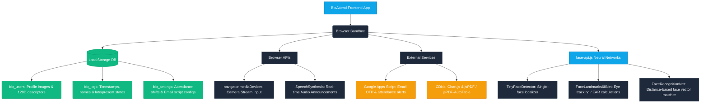
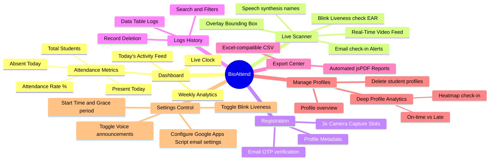

# BioAttend 🚀

**BioAttend** is a secure, high-precision, and completely client-side biometric attendance system running directly in your web browser. Driven by advanced deep learning (`face-api.js` powered by TensorFlow.js), it performs real-time face detection, 68-point facial landmark mapping, 128-dimensional embedding matching, and active blink liveness detection—all while maintaining 100% data privacy.

---

## 🗺️ System Architecture & Workflow

Here is the high-level system architecture showing how the frontend coordinates camera inputs, local storage, external CDN resources, and background AI processes:



---

## 🧠 Application Feature Mindmap

The functional components of BioAttend are distributed across seven main operational areas:



---

## ✨ Key Capabilities & Highlights

*   **Zero Server Architecture (100% Privacy)**: Facial features are mapped into 128-dimensional floating-point vectors and stored inside the browser's `LocalStorage`. Images and biometric vectors are never uploaded to a cloud host.
*   **Active Liveness Detection (Anti-Spoofing)**: Uses real-time 68-point landmarks to measure Eye Aspect Ratio (EAR). The scanner prompts the user to blink, verifying physiological response before log creation.
*   **Voice Synthesized Feedback**: Uses the browser's native text-to-speech engine to greet students by name ("Attendance marked for John Doe"), speeding up check-in queues.
*   **Dynamic Analytics & Heatmaps**: Click on any student's record or avatar to view a custom analytics modal featuring a 14-day grid-based check-in heatmap, attendance percentages, and check-in history.
*   **Automated Email Notifications**: Can send instant registration OTPs and attendance check-in receipts directly to the student's email address, with optional copy notification to the administrator.
*   **Multi-Format Exporting**: Supports exporting raw logs to an Excel-compatible CSV format or downloading full PDF report summaries with custom autotables.

---

## ⚡ Mathematical Blink Liveness Detection (EAR)

To prevent spoofing attacks (e.g. holding a student's photo in front of the camera), BioAttend measures the **Eye Aspect Ratio (EAR)** using 6 facial landmarks mapped per eye:

$$\text{EAR} = \frac{||p_2 - p_6|| + ||p_3 - p_5||}{2 ||p_1 - p_4||}$$

```
      p2     p3
    .-----------.
 p1 (           ) p4
    `-----------'
      p6     p5
```

### Liveness Verification Sequence:
1. **Ready**: The scanner locks onto the face descriptor and verifies the match.
2. **Open Detection**: Measures EAR $> 0.25$ to confirm eyes are open.
3. **Blink Detection**: Monitors for an instantaneous drop where EAR $< 0.20$ (indicating eyes closed).
4. **Finalize**: Measures EAR return to $> 0.25$ within the blink timeline. Upon completion, the check-in is logged.

---

## 🚀 Setup & & Running Locally

Due to modern browser **CORS (Cross-Origin Resource Sharing)** security restrictions, deep learning models cannot be loaded dynamically over the `file://` protocol. The application **must** be served through a local web server.

### Option 1: Python HTTP Server (Zero configuration)
If you have Python installed, navigate to the folder in your terminal and run:
```bash
python -m http.server 8000
```
Then visit: [http://localhost:8000](http://localhost:8000)

### Option 2: Node.js (via http-server)
If you have npm installed, run:
```bash
npx http-server -p 8000
```
Then visit: [http://localhost:8000](http://localhost:8000)

### Option 3: VS Code Live Server Extension
1. Open the project folder in Visual Studio Code.
2. Search for and install the **"Live Server"** extension by Ritwick Dey.
3. Click the **"Go Live"** button in the bottom status bar, or right-click `index.html` and choose **"Open with Live Server"**.

---

## ⚙️ Google Apps Script Email Notification Setup

To integrate 100% free registration email OTPs and attendance check-in receipt alerts:

1. Open [Google Apps Script](https://script.google.com/) and click **New Project**.
2. Replace the default editor code with the following script:
   ```javascript
   function doPost(e) {
     try {
       var data = JSON.parse(e.postData.contents);
       var recipient = data.to;
       var subject = data.subject;
       var body = data.body;
       
       MailApp.sendEmail(recipient, subject, body);
       
       return ContentService.createTextOutput(JSON.stringify({ "status": "success" }))
         .setMimeType(ContentService.MimeType.JSON);
     } catch (error) {
       return ContentService.createTextOutput(JSON.stringify({ "status": "error", "message": error.toString() }))
         .setMimeType(ContentService.MimeType.JSON);
     }
   }
   ```
3. Click **Deploy > New Deployment** in the top menu.
4. Click the gear icon next to "Select type" and select **Web App**.
5. Configure the deployment settings:
   * **Execute as:** `Me (your-email@gmail.com)`
   * **Who has access:** `Anyone`
6. Click **Deploy** and authorize any account access permissions if prompted.
7. Copy the generated **Web App URL** (e.g. `https://script.google.com/macros/s/.../exec`).
8. Open BioAttend settings, enable **OTP Verification on Registration**, select **Email Service**, paste the URL into the script input field, and save the settings.

---

## 🔒 Security & LocalStorage Warning

> [!WARNING]
> Because BioAttend runs completely on browser storage APIs:
> - Clearing your browser cache or site storage **will delete all profiles and logs**.
> - It is recommended to perform regular weekly data backups by downloading the logs via the **Export** view.
> - For enterprise-scale applications, you should replace the storage calls in `js/db.js` with calls to a remote backend server (e.g. Node.js with PostgreSQL/MongoDB).
